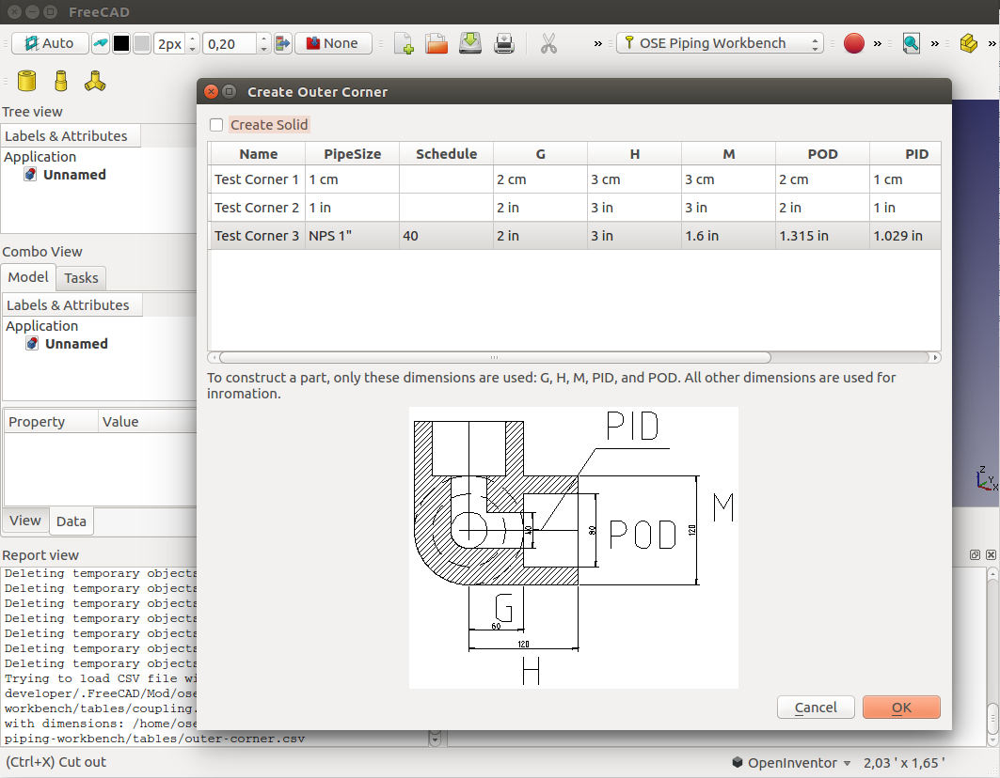

# OSE piping workbench
This will be a OSE piping workbench. As a start point it uses https://github.com/skaiser/FreeCAD_Workbench_Starter.git

[Python Style Guide](https://www.python.org/dev/peps/pep-0008/)


## Installation
[See](https://www.freecadweb.org/wiki/How_to_install_additional_workbenches)

### Linux

````
$ mkdir ~/.FreeCAD/Mod
$ cd ~/.FreeCAD/Mod
$ git clone https://github.com/rkrenzler/ose-piping-workbench.git
````

# Screenshots #
